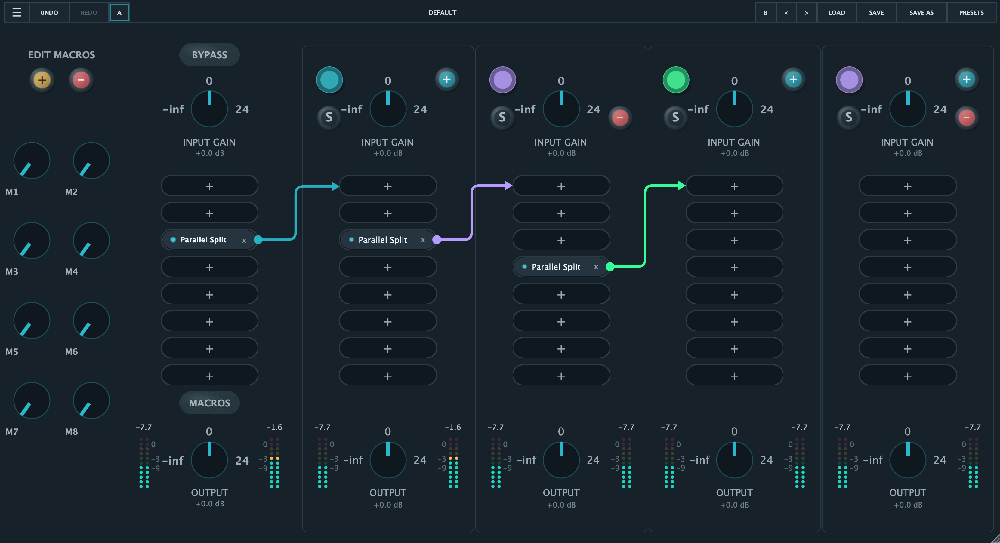

# Hostr

A JUCE audio rack for building serial chains, parallel splits, and nested routing inside a single insert, without multiplying buses and tracks in your DAW.
## Download Installer

- [Download the latest release](https://github.com/PlugLynk/Hostr/releases/latest)
- [macOS installer](Installers/MacOS/HostrMacOS.zip)
- [Windows installer](Installers/Windows/HostrWindows.zip)
- [Linux installer](Installers/Linux/HostrLinux.zip)

## Sondaggio Beta Testers

If you try Hostr, I ask you to report any bugs by answering a few questions in the beta testers survey:

### [Apri il sondaggio Beta Testers](https://docs.google.com/forms/d/e/1FAIpQLScb817Rfri17RVmvtgSvn-ZfyyZXaAr_RFoCriAb4hANGFAZA/viewform)

Il feedback piu' utile include sistema operativo, DAW, risultato della scansione plugin, comportamento dei Parallel Split, crash, problemi di UI, plugin mancanti o drop-out audio.

## Features

- Host VST3 and AU effects inside a single Hostr instance.
- Build serial master chains with up to 8 plugin slots.
- Add Parallel Split modules to create multiple independent chains.
- Nest Parallel Split modules inside other parallel chains.
- Move plugins between the master rack and split chains with drag and drop.
- Control input gain, output gain, mute, solo, bypass, and live meters per chain.
- Map 8 macro controls to hosted plugin parameters.
- Save and load `.hostrpreset` files with plugin metadata, plugin state, macro mappings, routing topology, chain gains, and bypass states.
- Scan local plugin folders and cache known plugin metadata.
- Switch between many visual skins.

## Hostr Audio Flow

Hostr keeps the signal path compact: the master rack can hold plugins or Parallel Split modules, and each split can contain more chains, more plugins, and even another split.

## Installation

1. Download the installer for your operating system from the selected folders.
- [macOS installer](Installers/MacOS/HostrMacOS.zip)
- [Windows installer](Installers/Windows/HostrWindows.zip)
- [Linux installer](Installers/Linux/HostrLinux.zip)
2. Close your DAW and any running audio plugin hosts.
3. Run the installer for your operating system.
4. Open your DAW and rescan plugins by selecting FULL RESCAN (CLEAR CACHE) from the menu.
5. Load Hostr as a plugin or launch the standalone app.
5. Enjoy!

## Build from Source

Open `Hostr.jucer` with Projucer, regenerate the exporter for your platform, then build the generated project in Xcode, Visual Studio, or your platform build system.

Generated IDE projects, build folders, installers, and release archives are intentionally not tracked in this source package.
